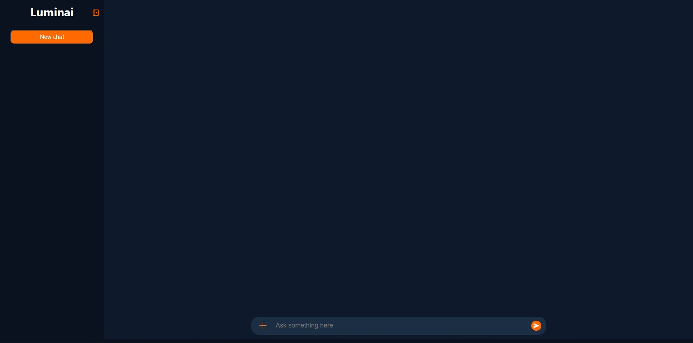
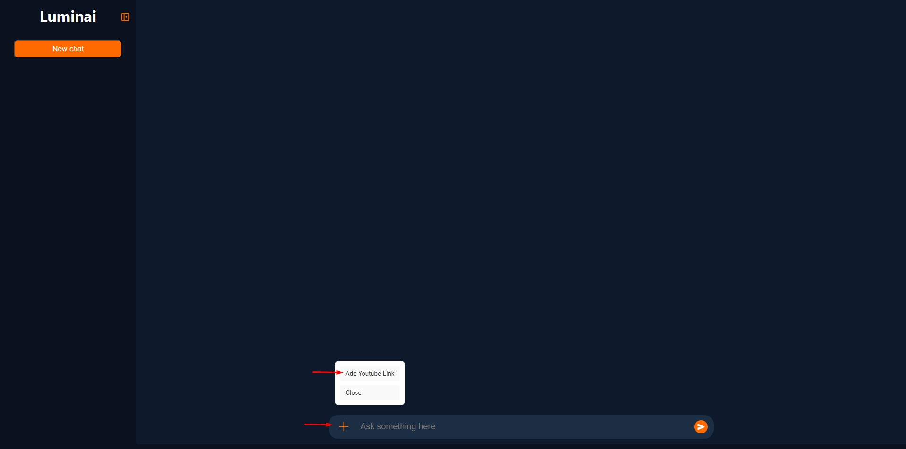
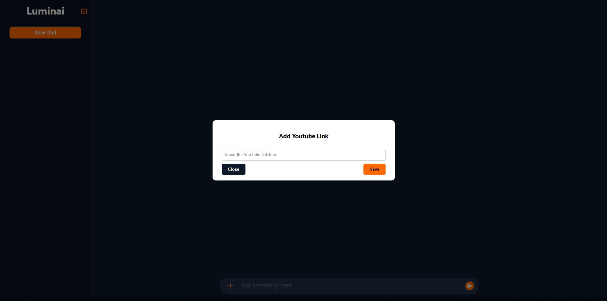
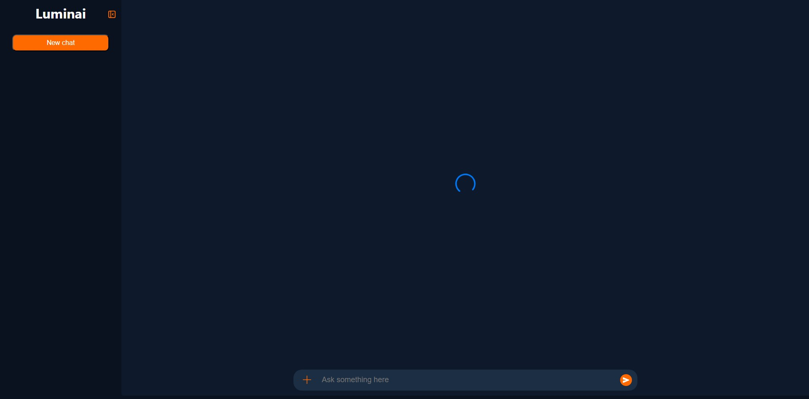
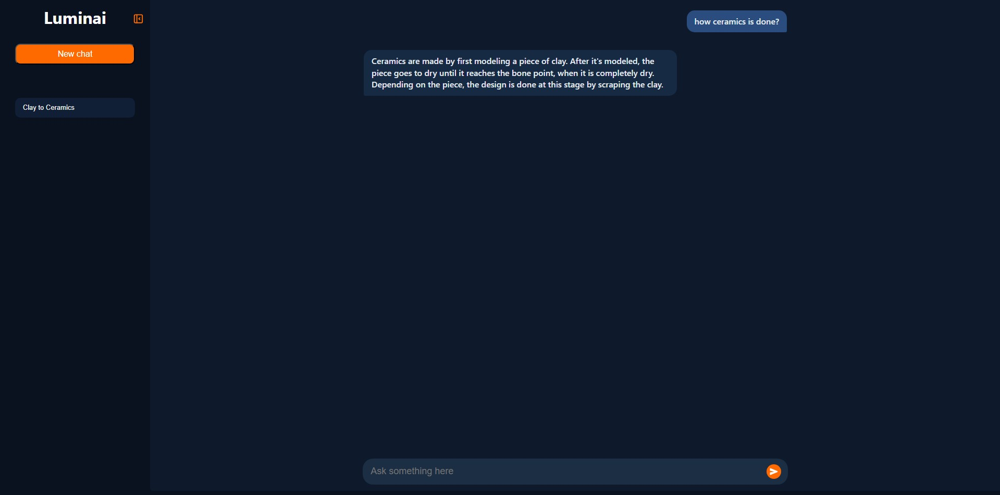
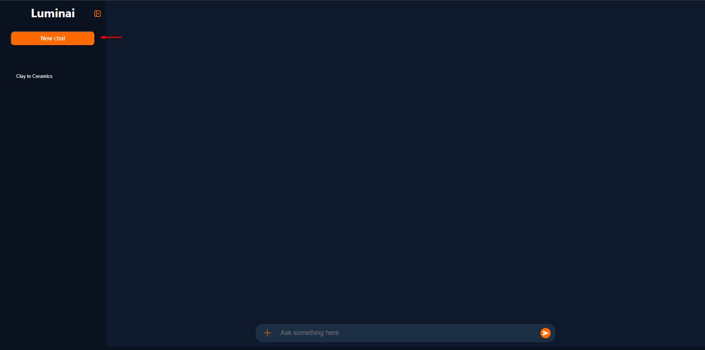
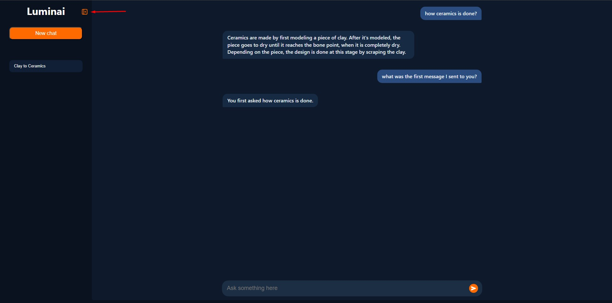
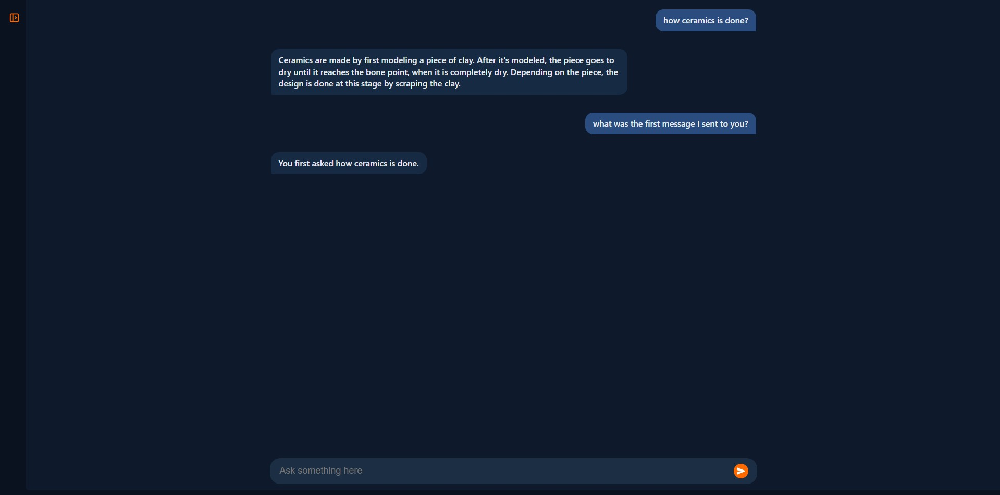

# Luminai
AI-powered tool that transcribes YouTube videos and answers your questions based on their content.

## About
Luminai was created to make consuming YouTube videos easier and faster.
You can ask Luminai to simplify and summarize the key points of a video, for example, a long podcast, helping you quickly grasp the most important information.

Powered by AI, Luminai has context about the selected video and memory of your conversation, so it remembers what you’ve discussed.

The workflow is simple:

1- Luminai downloads the audio track of the chosen video.

2- The audio is transcribed into text.

3- This text is converted into vector embeddings and stored in a database.

4- The stored data is then used as context for the AI to answer your questions.

## Installation & Setup

#### Pre-required:
- **[Node.js](https://nodejs.org/)** and npm
- **[Python](https://www.python.org/)** and pip

### Backend Setup (API)

```bash
# Clone the repository
git clone https://github.com/carlosdavidantas/luminai.git

# Navigate to the API folder
cd src/api

# Create a virtual environment
python -m venv .venv  # Windows
python3 -m venv .venv  # Linux

# Activate the virtual environment
.\.venv\Scripts\activate  # Windows
source .venv/bin/activate  # Linux

# Install dependencies
pip install -r requirements.txt # Windows
pip3 install -r requirements.txt # Linux

# Run the API
python api.py  # Windows
python3 api.py # Linux
```

### Frontend Setup

```bash
# Open a new terminal and navigate to the frontend
cd src/web-interface/app

# Install dependencies
npm install

# Start the development server
npm start


```
Your default browser will open Luminai at http://localhost:3000.

## Usage Guide

Home screen


Click the “+” button, then click **“Add YouTube Link”**:


Enter your YouTube link in the modal and click **Save**:


Wait while Luminai processes the video:


When it’s ready, your chat will appear on the left side:


Now you can **ask anything** related to the video:


Luminai has **memory**, so it remembers your previous messages:


To start a new chat, click **“New Chat”**, the screen will reset and you can add a new video:


To **delete a chat**, hover over it and click the **delete button** that appears:


You can also **toggle the sidebar** to show or hide your chat history:




## Tecnologies
- React.js
- Javascript
- Flask
- Python
- Langchain
- Retrieval-Augmented Generation (RAG)
- Chroma
- Whisper AI
- Geminai AI

## License
This project is licensed under the **MIT License**. <br>
See the **[LICENSE](./LICENSE)** file for details.

<br>
<br>

## Author
<table>
    <tbody>
        <tr>
            <td>
                
            </td>
        </tr>
    </tbody>
</table>

**[Carlos Davi Dantas](https://github.com/carlosdavidantas)**
